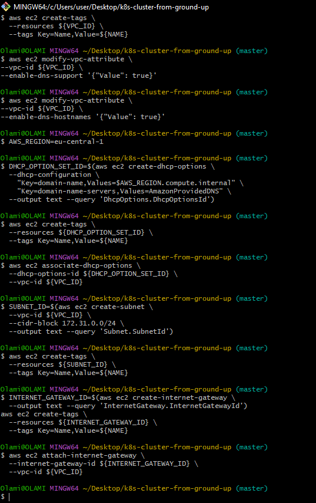
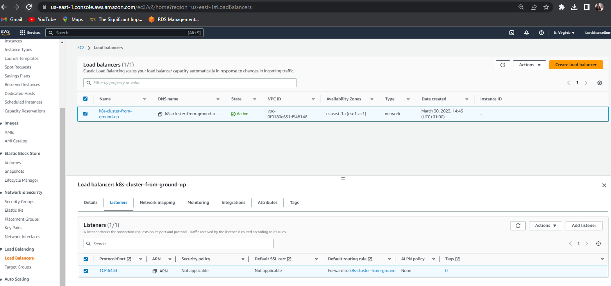
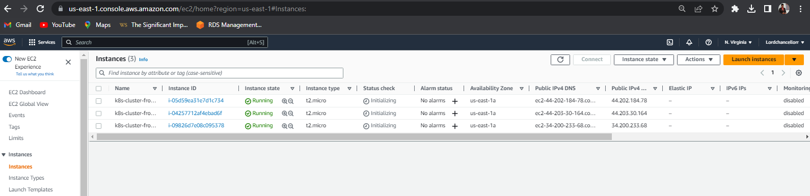
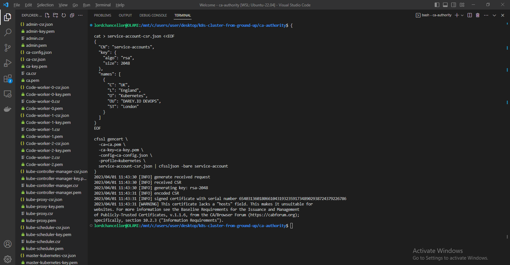
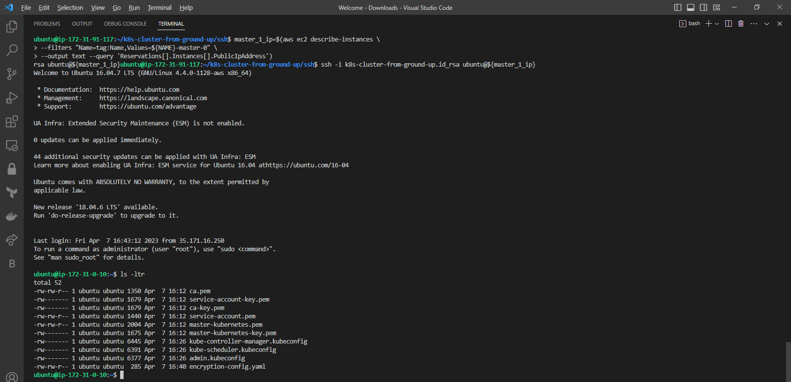
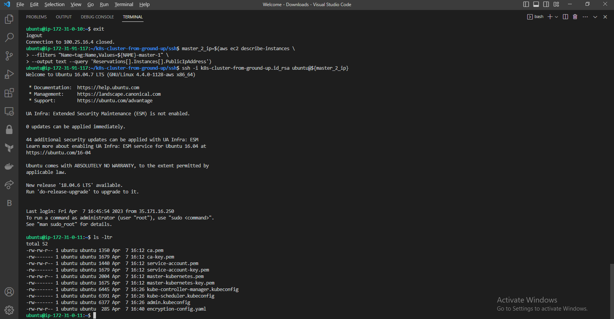
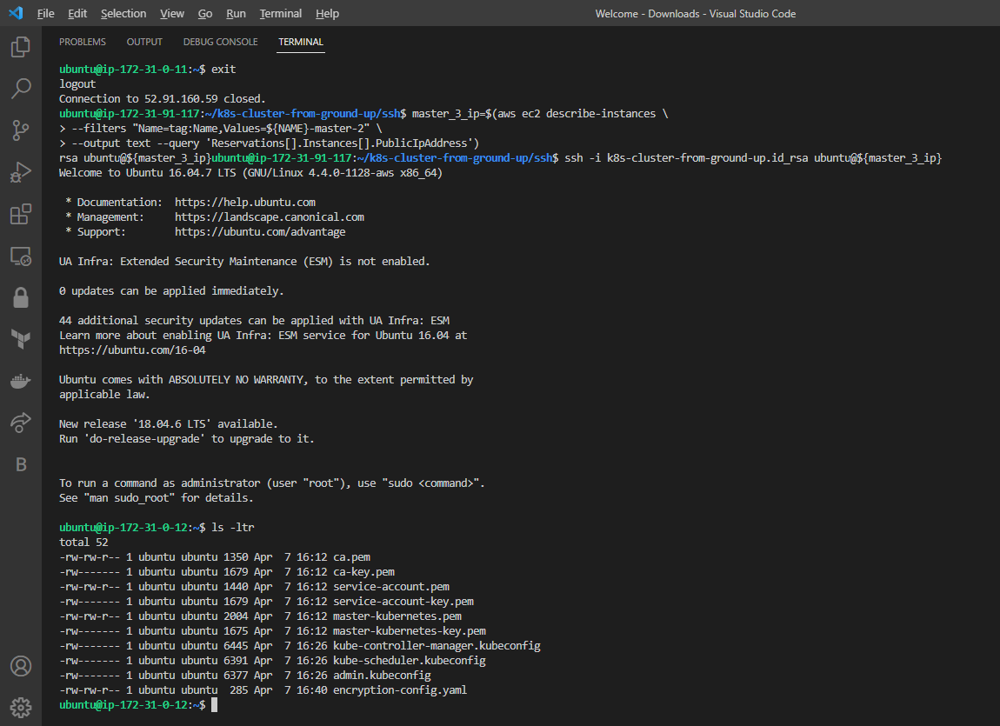

# ORCHESTRATING CONTAINERS ACROSS MULTIPLE VIRTUAL SERVERS WITH KUBERNETES. PART 1
In previous Project 20 we started working with containerization and have learned how to prepare and deploy a Docker container using Docker Compose.
**In this project, we will continue building upon your containerization skills, and begin to work on industry tools that fit for production deployment. Containers are the most lightweight and easily transferrable workloads, they start faster than VMs, consume less space and memory and, they perfectly fit to accommodate microservice architecture. It means that number of containers will be usually significantly higher that number of VMs and with number comes complexity of managing containers.**
To manage a fleet of containers you can use different software solutions, but the most widely used one is Kubernetes (also referred as K8s). It was originally developed by Google and now being maintained by Cloud Native Computing Foundation (CNCF).

Why has it become so popular? It is a powerful Swiss-army knife when it comes to managing multiple containers in production-grade solutions.

For now we will not list down all the features and benefits of Kubernetes, you can watch this overview video to get to know more, but you certainly must have this tool in your DevOps arsenal and know when and how to use if for production-grade deployments
## Container Orchestration with Kubernetes
- Unlike virtual machines, they are not designed to run for a very long time. By design, Docker containers are ephemeral. By “ephemeral” it means that a container can be stopped and destroyed, and a new one can be built from the same Docker image and put in place with an absolute minimum set-up and configuration requirement.

To ensure that container workloads are highly scalable, they must be configured to run across multiple compute nodes. A compute node can be a physical server or a virtual machine with Docker engine installed to run your containers.
If we had two compute nodes to run our containers, let us consider a following scenarios:

- Given the two points mentioned above, if containers are configured to run across 2 computer nodes, and a particular container, running on Node 1 dies, how will it know that it can spin up again on Node 2?
Let us imagine that Tooling website container is running on Node 1, and MySQL container is running on Node 2, how will both containers be able to communicate with each other? Remember in Project 20, we had to create a custom network on the same host and ensure that they can communicate through that network. But in the case of 2 separate hosts, this is natively not possible.
Container orchestration is a concept that allows to address these two scenarios, it provides automation of all the aspects of coordinating and managing containers. Container orchestration is focused on managing life cycle of containers and their dynamic environments.
 It is about automating the entire lifecycle of containers running across multiple nodes:

Configuring and scheduling of containers on nodes
Ensuring the availability of containers, even when they die
Scaling of containers to equally balance application workloads across infrastructure
Allocation of resources between containers
Load balancing, traffic routing and service discovery of containers
Health monitoring of containers
Securing the interactions between containers.
Kubernetes is a tool designed to do Container Orchestration and it does its job very well when correctly configured.

As mentioned earlier, there are other alternatives to Docker Compose. But, throughout the entire PBL program, we will not focus on Docker Swarm. We will rather spend more time with Kubernetes. Part of the reason for this is because Kubernetes has more functionalities and is widely in use in the industry.

## **KUBERNETES ARCHITECTURE**
Kubernetes is a not a single package application that you can install with one command, it is comprised of several components, some of them can be deployed as services, some can be also deployed as separate containers.
The kubernetes arcitecture looks exacty like the diagram below:


## **Kubernetes From-Ground-Up**
K8s installation options
So far, Kubernetes sounds like a lot of fun, right? With its intuitive architecture, and rich configuration options, you may already want to jump right in, spin up a few VMs and begin to install and configure a Kubernetes cluster. But hold on for a second. Installing and configuring Kubernetes is far from being a walk in the park, i.e., it is very difficult to implement and get it ready for production. Especially, if you want to setup a highly available, and secure Kubernetes cluster.

The good news is, there are open-source tools available today that already has all the hard work done and you can plug into them easily. An example of that is minikube, which can be used during testing and development.

For a better understanding of each aspect of spinning up a Kubernetes cluster, we will do it without any automated helpers. You will install each and every component manually from scratch and learn how to make them work together – we call this approach "K8s From-Ground-Up".

To successfully implement "K8s From-Ground-Up", the following and even more will be done by you as a K8s administrator:

- Install and configure master (also known as control plane) components and worker nodes (or just nodes).
- Apply security settings across the entire cluster (i.e., encrypting the data in transit, and at rest)
- In transit encryption means encrypting communications over the network using HTTPS
- At rest encryption means encrypting the data stored on a disk
- Plan the capacity for the backend data store etcd
- Configure network plugins for the containers to communicate
- Manage periodical upgrade of the cluster
- Configure observability and auditing

**DISCLAIMER:** The following setup of Kubernetes should be used for learning purpose only, and not to be considered for production. This is because setting up a K8s cluster for production use has a lot more moving parts, especially when it comes to planning the nodes, and securing the cluster. The purpose of "K8s From-Ground-Up" is to get you much closer to the different components as shown in the architecture diagram and relate with what you have been learning about Kubernetes.

***Tools to be used and expected result of the Project 20***

- Virtual Machine: AWS EC2
- Operating System: Ubuntu 20.04 lts+
- Docker Engine
- kubectl console utility
- cfssl and cfssljson utilities
- Kubernetes cluster

**You will create 3 EC2 Instances, and in the end, we will have the following parts of the cluster properly configured:**

- One Kubernetes Master
- Two Kubernetes Worker Nodes
- Configured SSL/TLS certificates for Kubernetes components to communicate securely
- Configured Node Network
- Configured Pod Network

**STEP 0-INSTALL CLIENT TOOLS BEFORE BOOTSTRAPPING THE CLUSTER.**
-
First, you will need some client tools installed and configurations made on your client workstation:

- awscli – is a unified tool to manage your AWS services
- kubectl – this command line utility will be your main control tool to manage your K8s cluster. You will use this tool so many times, so you will be able to type ‘kubetcl’ on your keyboard with a speed of light. You can always make a shortcut (alias) to just one character ‘k’. Also, add this extremely useful official kubectl Cheat Sheet to your bookmarks, it has examples of the most used ‘kubectl’ commands.
- cfssl – an open source toolkit for everything TLS/SSL from Cloudflare
- cfssljson – a program, which takes the JSON output from the cfssl and writes certificates, keys, CSRs, and bundles to disk.

- Install and configure AWS CLI
Configure AWS CLI to access all AWS services used, for this you need to have a user with programmatic access keys configured in AWS Identity and Access Management (IAM)
- To configure your AWS CLI – run your shell (or cmd if using Windows) and run:
- ` aws configure --profile %your_username%`
 - AWS Access Key ID [None]: *...........*
 - AWS Secret Access Key [None]: *...........*
- Default region name [None]: *.......*
- Default output format [None]: *.........*

Test your AWS CLI by running:
 `aws ec2 describe-vpcs`

**Install kubectl**
- Kubernetes cluster has a Web API that can receive HTTP/HTTPS requests, but it is quite cumbersome to curl an API each and every time you need to send some command, so kubectl command tool was developed to ease a K8s administrator’s life.

With this tool we can easily interact with Kubernetes to deploy applications, inspect and manage cluster resources, view logs and perform many more administrative operations.

- Linux Or Windows using Gitbash or similar tool

**Download the binary**

`wget https://storage.googleapis.com/kubernetes-release/release/v1.21.0/bin/linux/amd64/kubectl`

- To make it executable, run: `chmod +x kubectl`
- To move to the Bin directory, `sudo mv kubectl /usr/local/bin/`
- To verify that kubectl version 1.21.0 or higher is installed, run: `kubectl version --client`

## Install CFSSL and CFSSLJSON
Run the following command: 
- `wget -q --show-progress --https-only --timestamping \
  https://storage.googleapis.com/kubernetes-the-hard-way/cfssl/1.4.1/linux/cfssl \
  https://storage.googleapis.com/kubernetes-the-hard-way/cfssl/1.4.1/linux/cfssljson`
 - `chmod +x cfssl cfssljson`
 - `sudo mv cfssl cfssljson /usr/local/bin/`

 ## **AWS CLOUD RESOURCES FOR KUBERNETES CLUSTER**
 In this section, you will provision EC2 Instances required to run your K8s cluster. You can use Terraform for this. But it is highly recommended to start out first with manual provisioning using awscli and have thorough knowledge about the whole setup. After that, you can destroy the entire project and start all over again using Terraform. This manual approach will solidify your skills and give you the opportunity to face more challenges.
 
- Step 1 – Configure Network Infrastructure
   - Create a directory named `k8s-cluster-from-ground-up`
   - Create a VPC and store the ID as a variable:
```
   VPC_ID=$(aws ec2 create-vpc \
--cidr-block 172.31.0.0/16 \
--output text --query 'Vpc.VpcId'
)
```
  - Tag the VPC so that it is named:
  ```
  NAME=k8s-cluster-from-ground-up

aws ec2 create-tags \
  --resources ${VPC_ID} \
  --tags Key=Name,Value=${NAME}
  ```
- Enable DNS support for your VPC:
```
aws ec2 modify-vpc-attribute \
--vpc-id ${VPC_ID} \
--enable-dns-support '{"Value": true}'
```

- Enable DNS support for hostnames:
```
aws ec2 modify-vpc-attribute \
--vpc-id ${VPC_ID} \
--enable-dns-hostnames '{"Value": true}'
```

- AWS Region

**Set the required region**
```
AWS_REGION=eu-central-1
```
**Dynamic Host Configuration Protocol – DHCP**

Configure DHCP Options Set:
Dynamic Host Configuration Protocol (DHCP) is a network management protocol used on Internet Protocol networks for automatically assigning IP addresses and other communication parameters to devices connected to the network using a client–server architecture.

AWS automatically creates and associates a DHCP option set for your Amazon VPC upon creation and sets two options: domain-name-servers (defaults to AmazonProvidedDNS) and domain-name (defaults to the domain name for your set region). AmazonProvidedDNS is an Amazon Domain Name System (DNS) server, and this option enables DNS for instances to communicate using DNS names.

By default EC2 instances have fully qualified names like ip-172-50-197-106.eu-central-1.compute.internal. But you can set your own configuration using an example below.
```
DHCP_OPTION_SET_ID=$(aws ec2 create-dhcp-options \
  --dhcp-configuration \
    "Key=domain-name,Values=$AWS_REGION.compute.internal" \
    "Key=domain-name-servers,Values=AmazonProvidedDNS" \
  --output text --query 'DhcpOptions.DhcpOptionsId')

  ```
- Tag the DHCP Option set:
```
aws ec2 create-tags \
  --resources ${DHCP_OPTION_SET_ID} \
  --tags Key=Name,Value=${NAME}
```

- Associate the DHCP Option set with the VPC:
```
aws ec2 associate-dhcp-options \
  --dhcp-options-id ${DHCP_OPTION_SET_ID} \
  --vpc-id ${VPC_ID}
```

- Create the Subnet:
```
SUBNET_ID=$(aws ec2 create-subnet \
  --vpc-id ${VPC_ID} \
  --cidr-block 172.31.0.0/24 \
  --output text --query 'Subnet.SubnetId')
aws ec2 create-tags \
  --resources ${SUBNET_ID} \
  --tags Key=Name,Value=${NAME}
  ```

- Create the Internet Gateway and attach it to the VPC:
```
INTERNET_GATEWAY_ID=$(aws ec2 create-internet-gateway \
  --output text --query 'InternetGateway.InternetGatewayId')
aws ec2 create-tags \
  --resources ${INTERNET_GATEWAY_ID} \
  --tags Key=Name,Value=${NAME}
aws ec2 attach-internet-gateway \
  --internet-gateway-id ${INTERNET_GATEWAY_ID} \
  --vpc-id ${VPC_ID}
```

- Create route tables, associate the route table to subnet, and create a route to allow external traffic to the Internet through the Internet Gateway:
```
ROUTE_TABLE_ID=$(aws ec2 create-route-table \
  --vpc-id ${VPC_ID} \
  --output text --query 'RouteTable.RouteTableId')
aws ec2 create-tags \
  --resources ${ROUTE_TABLE_ID} \
  --tags Key=Name,Value=${NAME}
aws ec2 associate-route-table \
  --route-table-id ${ROUTE_TABLE_ID} \
  --subnet-id ${SUBNET_ID}
aws ec2 create-route \
  --route-table-id ${ROUTE_TABLE_ID} \
  --destination-cidr-block 0.0.0.0/0 \
  --gateway-id ${INTERNET_GATEWAY_ID}
```

- SECURITY GROUPS


Configure security groups
# Create the security group and store its ID in a variable
```
SECURITY_GROUP_ID=$(aws ec2 create-security-group \
  --group-name ${NAME} \
  --description "Kubernetes cluster security group" \
  --vpc-id ${VPC_ID} \
  --output text --query 'GroupId')
```
# Create the NAME tag for the security group
```
aws ec2 create-tags \
  --resources ${SECURITY_GROUP_ID} \
  --tags Key=Name,Value=${NAME}
```


# Create Inbound traffic for all communication within the subnet to connect on ports used by the master node(s)
```
aws ec2 authorize-security-group-ingress \
    --group-id ${SECURITY_GROUP_ID} \
    --ip-permissions IpProtocol=tcp,FromPort=2379,ToPort=2380,IpRanges='[{CidrIp=172.31.0.0/24}]'
```
# Create Inbound traffic for all communication within the subnet to connect on ports used by the worker nodes
```
aws ec2 authorize-security-group-ingress \
    --group-id ${SECURITY_GROUP_ID} \
    --ip-permissions IpProtocol=tcp,FromPort=30000,ToPort=32767,IpRanges='[{CidrIp=172.31.0.0/24}]'
```

Create inbound traffic to allow connections to the Kubernetes API Server listening on port 6443
```
aws ec2 authorize-security-group-ingress \
  --group-id ${SECURITY_GROUP_ID} \
  --protocol tcp \
  --port 6443 \
  --cidr 0.0.0.0/0
```
# Create Inbound traffic for SSH from anywhere (Do not do this in production. Limit access ONLY to IPs or CIDR that MUST connect)
```
aws ec2 authorize-security-group-ingress \
  --group-id ${SECURITY_GROUP_ID} \
  --protocol tcp \
  --port 22 \
  --cidr 0.0.0.0/0
```
# Create ICMP ingress for all types
```
aws ec2 authorize-security-group-ingress \
  --group-id ${SECURITY_GROUP_ID} \
  --protocol icmp \
  --port -1 \
  --cidr 0.0.0.0/0
```

- Create a network Load balancer:
```
LOAD_BALANCER_ARN=$(aws elbv2 create-load-balancer \
--name ${NAME} \
--subnets ${SUBNET_ID} \
--scheme internet-facing \
--type network \
--output text --query 'LoadBalancers[].LoadBalancerArn')
```


- Tagret Group

Create a target group: (For now it will be unhealthy because there are no real targets yet.)
```
TARGET_GROUP_ARN=$(aws elbv2 create-target-group \
  --name ${NAME} \
  --protocol TCP \
  --port 6443 \
  --vpc-id ${VPC_ID} \
  --target-type ip \
  --output text --query 'TargetGroups[].TargetGroupArn')
```

Register targets: (Just like above, no real targets. You will just put the IP addresses so that, when the nodes become available, they will be used as targets.)
```
aws elbv2 register-targets \
  --target-group-arn ${TARGET_GROUP_ARN} \
  --targets Id=172.31.0.1{0,1,2}
```


Create a listener to listen for requests and forward to the target nodes on TCP port 6443
```
aws elbv2 create-listener \
--load-balancer-arn ${LOAD_BALANCER_ARN} \
--protocol TCP \
--port 6443 \
--default-actions Type=forward,TargetGroupArn=${TARGET_GROUP_ARN} \
--output text --query 'Listeners[].ListenerArn'
```


- Get the Kubernetes Public address

```
KUBERNETES_PUBLIC_ADDRESS=$(aws elbv2 describe-load-balancers \
--load-balancer-arns ${LOAD_BALANCER_ARN} \
--output text --query 'LoadBalancers[].DNSName')
```
**Step 2 – Create Compute Resources**
-
- Get an image to create EC2 instances:
```
IMAGE_ID=$(aws ec2 describe-images --owners 099720109477 \
  --filters \
  'Name=root-device-type,Values=ebs' \
  'Name=architecture,Values=x86_64' \
  'Name=name,Values=ubuntu/images/hvm-ssd/ubuntu-xenial-16.04-amd64-server-*' \
  | jq -r '.Images|sort_by(.Name)[-1]|.ImageId')
```
- Create SSH Key-Pair
```
mkdir -p ssh

aws ec2 create-key-pair \
  --key-name ${NAME} \
  --output text --query 'KeyMaterial' \
  > ssh/${NAME}.id_rsa
chmod 600 ssh/${NAME}.id_rsa
```
- EC2 Instances for Controle Plane (Master Nodes)
- Create 3 Master nodes: Note – Using t2.micro instead of t2.small as t2.micro is covered by AWS free tier
```
for i in 0 1 2; do
  instance_id=$(aws ec2 run-instances \
    --associate-public-ip-address \
    --image-id ${IMAGE_ID} \
    --count 1 \
    --key-name ${NAME} \
    --security-group-ids ${SECURITY_GROUP_ID} \
    --instance-type t2.micro \
    --private-ip-address 172.31.0.1${i} \
    --user-data "name=master-${i}" \
    --subnet-id ${SUBNET_ID} \
    --output text --query 'Instances[].InstanceId')
  aws ec2 modify-instance-attribute \
    --instance-id ${instance_id} \
    --no-source-dest-check
  aws ec2 create-tags \
    --resources ${instance_id} \
    --tags "Key=Name,Value=${NAME}-master-${i}"
done
```

- EC2 Instances for Worker Nodes
- Create 3 worker nodes:
```
for i in 0 1 2; do
  instance_id=$(aws ec2 run-instances \
    --associate-public-ip-address \
    --image-id ${IMAGE_ID} \
    --count 1 \
    --key-name ${NAME} \
    --security-group-ids ${SECURITY_GROUP_ID} \
    --instance-type t2.micro \
    --private-ip-address 172.31.0.2${i} \
    --user-data "name=worker-${i}|pod-cidr=172.20.${i}.0/24" \
    --subnet-id ${SUBNET_ID} \
    --output text --query 'Instances[].InstanceId')
  aws ec2 modify-instance-attribute \
    --instance-id ${instance_id} \
    --no-source-dest-check
  aws ec2 create-tags \
    --resources ${instance_id} \
    --tags "Key=Name,Value=${NAME}-worker-${i}"
done
```
Pictures of the instances after creation:
.PNG)



**Step 3 Prepare The Self-Signed Certificate Authority And Generate TLS Certificates**
-
The following components running on the Master node will require TLS certificates.

- kube-controller-manager
- kube-scheduler
- etcd
- kube-apiserver
 
 The following components running on the Worker nodes will require TLS certificates.

- kubelet
- kube-proxy

Therefore, you will provision a PKI Infrastructure using cfssl which will have a Certificate Authority. The CA will then generate certificates for all the individual components.

**Self-Signed Root Certificate Authority (CA)**

Here, you will provision a CA that will be used to sign additional TLS certificates.

- Create a directory and cd into it:
```
mkdir ca-authority && cd ca-authority
```
- Generate the CA configuration file, Root Certificate, and Private key:
```
{

cat > ca-config.json <<EOF
{
  "signing": {
    "default": {
      "expiry": "8760h"
    },
    "profiles": {
      "kubernetes": {
        "usages": ["signing", "key encipherment", "server auth", "client auth"],
        "expiry": "8760h"
      }
    }
  }
}
EOF

cat > ca-csr.json <<EOF
{
  "CN": "Kubernetes",
  "key": {
    "algo": "rsa",
    "size": 2048
  },
  "names": [
    {
      "C": "UK",
      "L": "England",
      "O": "Kubernetes",
      "OU": "DAREY.IO DEVOPS",
      "ST": "London"
    }
  ]
}
EOF

cfssl gencert -initca ca-csr.json | cfssljson -bare ca

}
```
## The file defines the following:

- CN – Common name for the authority

- algo – the algorithm used for the certificates

- size – algorithm size in bits

- C  – Country

- L – Locality (city)

- ST – State or province

- O – Organization

- OU – Organizational Unit

***List the directory to see the created files***

```
ls -ltr
```

ca.pem – The Root Certificate
ca-key.pem – The Private Key
ca.csr – The Certificate Signing Request
Generating TLS Certificates For Client and Server

You will need to provision Client/Server certificates for all the components. It is a MUST to have encrypted communication within the cluster. Therefore, the server here are the master nodes running the api-server component. While the client is every other component that needs to communicate with the api-server.

Now we have a certificate for the Root CA, we can then begin to request more certificates which the different Kubernetes components, i.e. clients and server, will use to have encrypted communication.

Remember, the clients here refer to every other component that will communicate with the api-server. These are:

- kube-controller-manager
- kube-scheduler
- etcd
- kubelet
- kube-proxy
- Kubernetes Admin User

Let us begin with the Kubernetes API-Server Certificate and Private Key

The certificate for the Api-server must have IP addresses, DNS names, and a Load Balancer address included. Otherwise, you will have a lot of difficulties connecting to the api-server.

Generate the Certificate Signing Request (CSR), Private Key and the Certificate for the Kubernetes Master Nodes.
```
{
cat > master-kubernetes-csr.json <<EOF
{
  "CN": "kubernetes",
   "hosts": [
   "127.0.0.1",
   "172.31.0.10",
   "172.31.0.11",
   "172.31.0.12",
   "ip-172-31-0-10",
   "ip-172-31-0-11",
   "ip-172-31-0-12",
   "ip-172-31-0-10.${AWS_REGION}.compute.internal",
   "ip-172-31-0-11.${AWS_REGION}.compute.internal",
   "ip-172-31-0-12.${AWS_REGION}.compute.internal",
   "${KUBERNETES_PUBLIC_ADDRESS}",
   "kubernetes",
   "kubernetes.default",
   "kubernetes.default.svc",
   "kubernetes.default.svc.cluster",
   "kubernetes.default.svc.cluster.local"
  ],
  "key": {
    "algo": "rsa",
    "size": 2048
  },
  "names": [
    {
      "C": "UK",
      "L": "England",
      "O": "Kubernetes",
      "OU": "DAREY.IO DEVOPS",
      "ST": "London"
    }
  ]
}
EOF

cfssl gencert \
  -ca=ca.pem \
  -ca-key=ca-key.pem \
  -config=ca-config.json \
  -profile=kubernetes \
  master-kubernetes-csr.json | cfssljson -bare master-kubernetes
}
```

- Creating the other certificates: for the following Kubernetes components:

- Scheduler Client Certificate
- Kube Proxy Client Certificate
- Controller Manager Client Certificate
- Kubelet Client Certificates
- K8s admin user Client Certificate
- kube-scheduler Client Certificate and Private Key
```
{

cat > kube-scheduler-csr.json <<EOF
{
  "CN": "system:kube-scheduler",
  "key": {
    "algo": "rsa",
    "size": 2048
  },
  "names": [
    {
      "C": "UK",
      "L": "England",
      "O": "system:kube-scheduler",
      "OU": "DAREY.IO DEVOPS",
      "ST": "London"
    }
  ]
}
EOF

cfssl gencert \
  -ca=ca.pem \
  -ca-key=ca-key.pem \
  -config=ca-config.json \
  -profile=kubernetes \
  kube-scheduler-csr.json | cfssljson -bare kube-scheduler

}
```
If you see any warning message, it is safe to ignore it.

kube-proxy Client Certificate and Private Key
```
{

cat > kube-proxy-csr.json <<EOF
{
  "CN": "system:kube-proxy",
  "key": {
    "algo": "rsa",
    "size": 2048
  },
  "names": [
    {
      "C": "UK",
      "L": "England",
      "O": "system:node-proxier",
      "OU": "DAREY.IO DEVOPS",
      "ST": "London"
    }
  ]
}
EOF

cfssl gencert \
  -ca=ca.pem \
  -ca-key=ca-key.pem \
  -config=ca-config.json \
  -profile=kubernetes \
  kube-proxy-csr.json | cfssljson -bare kube-proxy

}
```
kube-controller-manager Client Certificate and Private Key
```
{
cat > kube-controller-manager-csr.json <<EOF
{
  "CN": "system:kube-controller-manager",
  "key": {
    "algo": "rsa",
    "size": 2048
  },
  "names": [
    {
      "C": "UK",
      "L": "England",
      "O": "system:kube-controller-manager",
      "OU": "DAREY.IO DEVOPS",
      "ST": "London"
    }
  ]
}
EOF

cfssl gencert \
  -ca=ca.pem \
  -ca-key=ca-key.pem \
  -config=ca-config.json \
  -profile=kubernetes \
  kube-controller-manager-csr.json | cfssljson -bare kube-controller-manager

}
```
Kubelet Client Certificate and Private Key
Similar to how you configured the api-server's certificate, Kubernetes requires that the hostname of each worker node is included in the client certificate.

Also, Kubernetes uses a special-purpose authorization mode called Node Authorizer, that specifically authorizes API requests made by kubelet services. In order to be authorized by the Node Authorizer, kubelets must use a credential that identifies them as being in the system:nodes group, with a username of system:node:<nodeName>. Notice the "CN": "system:node:${instance_hostname}", in the below code.

Therefore, the certificate to be created must comply to these requirements. In the below example, there are 3 worker nodes, hence we will use bash to loop through a list of the worker nodes’ hostnames, and based on each index, the respective Certificate Signing Request (CSR), private key and client certificates will be generated.
```
for i in 0 1 2; do
  instance="${NAME}-worker-${i}"
  instance_hostname="ip-172-31-0-2${i}"
  cat > ${instance}-csr.json <<EOF
{
  "CN": "system:node:${instance_hostname}",
  "key": {
    "algo": "rsa",
    "size": 2048
  },
  "names": [
    {
      "C": "UK",
      "L": "England",
      "O": "system:nodes",
      "OU": "DAREY.IO DEVOPS",
      "ST": "London"
    }
  ]
}
EOF

  external_ip=$(aws ec2 describe-instances \
    --filters "Name=tag:Name,Values=${instance}" \
    --output text --query 'Reservations[].Instances[].PublicIpAddress')

  internal_ip=$(aws ec2 describe-instances \
    --filters "Name=tag:Name,Values=${instance}" \
    --output text --query 'Reservations[].Instances[].PrivateIpAddress')

  cfssl gencert \
    -ca=ca.pem \
    -ca-key=ca-key.pem \
    -config=ca-config.json \
    -hostname=${instance_hostname},${external_ip},${internal_ip} \
    -profile=kubernetes \
    ${NAME}-worker-${i}-csr.json | cfssljson -bare ${NAME}-worker-${i}
done
```

- Finally, kubernetes admin user's Client Certificate and Private Key
```
{
cat > admin-csr.json <<EOF
{
  "CN": "admin",
  "key": {
    "algo": "rsa",
    "size": 2048
  },
  "names": [
    {
      "C": "UK",
      "L": "England",
      "O": "system:masters",
      "OU": "DAREY.IO DEVOPS",
      "ST": "London"
    }
  ]
}
EOF

cfssl gencert \
  -ca=ca.pem \
  -ca-key=ca-key.pem \
  -config=ca-config.json \
  -profile=kubernetes \
  admin-csr.json | cfssljson -bare admin
}
```
Actually, we are not done yet!
There is one more pair of certificate and private key we need to generate. That is for the Token Controller: a part of the Kubernetes Controller Manager kube-controller-manager responsible for generating and signing service account tokens which are used by pods or other resources to establish connectivity to the api-server. Read more about Service Accounts from the official documentation.

Alright, let us quickly create the last set of files, and we are done with PKIs
```
{

cat > service-account-csr.json <<EOF
{
  "CN": "service-accounts",
  "key": {
    "algo": "rsa",
    "size": 2048
  },
  "names": [
    {
      "C": "UK",
      "L": "England",
      "O": "Kubernetes",
      "OU": "DAREY.IO DEVOPS",
      "ST": "London"
    }
  ]
}
EOF

cfssl gencert \
  -ca=ca.pem \
  -ca-key=ca-key.pem \
  -config=ca-config.json \
  -profile=kubernetes \
  service-account-csr.json | cfssljson -bare service-account
}
```
Check the image below to see repositories created:

 
Step 4 – Distributing the Client and Server Certificates
Now it is time to start sending all the client and server certificates to their respective instances.

Let us begin with the worker nodes:

- Copy these files securely to the worker nodes using scp utility

Root CA certificate – ca.pem
X509 Certificate for each worker node
Private Key of the certificate for each worker node
```
for i in 0 1 2; do
  instance="${NAME}-worker-${i}"
  external_ip=$(aws ec2 describe-instances \
    --filters "Name=tag:Name,Values=${instance}" \
    --output text --query 'Reservations[].Instances[].PublicIpAddress')
  scp -i ../ssh/${NAME}.id_rsa \
    ca.pem ${instance}-key.pem ${instance}.pem ubuntu@${external_ip}:~/; \
done
```
Master or Controller node: – Note that only the api-server related files will be sent over to the master nodes.
```
for i in 0 1 2; do
instance="${NAME}-master-${i}" \
  external_ip=$(aws ec2 describe-instances \
    --filters "Name=tag:Name,Values=${instance}" \
    --output text --query 'Reservations[].Instances[].PublicIpAddress')
  scp -i ../ssh/${NAME}.id_rsa \
    ca.pem ca-key.pem service-account-key.pem service-account.pem \
    master-kubernetes.pem master-kubernetes-key.pem ubuntu@${external_ip}:~/;
done
```

Check the iomages below to see the graphical output of the distribution.


After this steps, we used `kubectl` to generate kubeconfig files for the kubelet, controller manager, kube-proxy, and scheduler clients and then the admin user.
Check the images below to see the graphical outcome of the instructions deployed:

- KUBE PROXY

- KUBE ADMIN

- KUBE CONTROLLER

- KUBE SCHEDULER

- Kube-Controller-Manager



# Step 6 Prepare the etcd database for encryption at rest.

Kubernetes uses etcd (A distributed key value store) to store variety of data which includes the cluster state, application configurations, and secrets. By default, the data that is being persisted to the disk is not encrypted. Any attacker that is able to gain access to this database can exploit the cluster since the data is stored in plain text. Hence, it is a security risk for Kubernetes that needs to be addressed.

To mitigate this risk, we must prepare to encrypt etcd at rest. "At rest" means data that is stored and persists on a disk. Anytime you hear "in-flight" or "in transit" refers to data that is being transferred over the network. "In-flight" encryption is done through TLS.

Generate the encryption key and encode it using base64

`ETCD_ENCRYPTION_KEY=$(head -c 64 /dev/urandom | base64)`

See the output that will be generated when called. Yours will be a different random string.


** Create an encryption-config.yaml file as documented officially by kubernetes
```
cat > encryption-config.yaml <<EOF
kind: EncryptionConfig
apiVersion: v1
resources:
  - resources:
      - secrets
    providers:
      - aescbc:
          keys:
            - name: key1
              secret: ${ETCD_ENCRYPTION_KEY}
      - identity: {}
EOF
```
Send the encryption file to the Controller nodes using scp and a for loop.

Bootstrap etcd cluster
TIPS: Use a terminal multi-plexer like multi-tabbed putty or tmux to work with multiple terminal sessions simultaneously. It will make your life easier, especially when you need to work on multiple nodes and run the same command across all nodes. Imagine repeating the same commands on 10 different nodes, and you don not intend to start automating with a configuration management tool like Ansible yet.

The primary purpose of the etcd component is to store the state of the cluster. This is because Kubernetes itself is stateless. Therefore, all its stateful data will persist in etcd. Since Kubernetes is a distributed system – it needs a distributed storage to keep persistent data in it. etcd is a highly-available key value store that fits the purpose. All K8s cluster configurations are stored in a form of key value pairs in etcd, it also stores the actual and desired states of the cluster. etcd cluster is intelligent enough to watch for changes made on one instance and almost instantly replicate those changes to the rest of the instances, so all of them will be always reconciled.


SSH into the controller server

Master-1
```
master_1_ip=$(aws ec2 describe-instances \
--filters "Name=tag:Name,Values=${NAME}-master-0" \
--output text --query 'Reservations[].Instances[].PublicIpAddress')
ssh -i k8s-cluster-from-ground-up.id_rsa ubuntu@${master_1_ip}
```


Master-2
```
master_2_ip=$(aws ec2 describe-instances \
--filters "Name=tag:Name,Values=${NAME}-master-1" \
--output text --query 'Reservations[].Instances[].PublicIpAddress')
ssh -i k8s-cluster-from-ground-up.id_rsa ubuntu@${master_2_ip}
```

Master-3
```
master_3_ip=$(aws ec2 describe-instances \
--filters "Name=tag:Name,Values=${NAME}-master-2" \
--output text --query 'Reservations[].Instances[].PublicIpAddress')
ssh -i k8s-cluster-from-ground-up.id_rsa ubuntu@${master_3_ip}
```

You should have a a similar pane like below. You should be able to see all the files that have been sent to the nodes.


Download and install etcd
```
  wget -q --show-progress --https-only --timestamping \
  "https://github.com/etcd-io/etcd/releases/download/v3.4.15/etcd-v3.4.15-linux-amd64.tar.gz"
  ```
  
Extract and install the etcd server and the etcdctl command line utility:
```
{
tar -xvf etcd-v3.4.15-linux-amd64.tar.gz
sudo mv etcd-v3.4.15-linux-amd64/etcd* /usr/local/bin/
}
```
Configure the etcd server
```
{
  sudo mkdir -p /etc/etcd /var/lib/etcd
  sudo chmod 700 /var/lib/etcd
  sudo cp ca.pem master-kubernetes-key.pem master-kubernetes.pem /etc/etcd/
}
```
The instance internal IP address will be used to serve client requests and communicate with etcd cluster peers. Retrieve the internal IP address for the current compute instance:
```
export INTERNAL_IP=$(curl -s http://169.254.169.254/latest/meta-data/local-ipv4)
```
Each etcd member must have a unique name within an etcd cluster. Set the etcd name to node Private IP address so it will uniquely identify the machine:
```
ETCD_NAME=$(curl -s http://169.254.169.254/latest/user-data/ \
  | tr "|" "\n" | grep "^name" | cut -d"=" -f2)
```
`echo ${ETCD_NAME}`
Create the etcd.service systemd unit file:
The flags are well documented here
```
cat <<EOF | sudo tee /etc/systemd/system/etcd.service
[Unit]
Description=etcd
Documentation=https://github.com/coreos

[Service]
Type=notify
ExecStart=/usr/local/bin/etcd \\
  --name ${ETCD_NAME} \\
  --trusted-ca-file=/etc/etcd/ca.pem \\
  --peer-trusted-ca-file=/etc/etcd/ca.pem \\
  --peer-client-cert-auth \\
  --client-cert-auth \\
  --listen-peer-urls https://${INTERNAL_IP}:2380 \\
  --listen-client-urls https://${INTERNAL_IP}:2379,https://127.0.0.1:2379 \\
  --advertise-client-urls https://${INTERNAL_IP}:2379 \\
  --initial-cluster-token etcd-cluster-0 \\
  --initial-cluster master-0=https://172.31.0.10:2380,master-1=https://172.31.0.11:2380,master-2=https://172.31.0.12:2380 \\
  --cert-file=/etc/etcd/master-kubernetes.pem \\
  --key-file=/etc/etcd/master-kubernetes-key.pem \\
  --peer-cert-file=/etc/etcd/master-kubernetes.pem \\
  --peer-key-file=/etc/etcd/master-kubernetes-key.pem \\
  --initial-advertise-peer-urls https://${INTERNAL_IP}:2380 \\
  --initial-cluster-state new \\
  --data-dir=/var/lib/etcd
Restart=on-failure
RestartSec=5

[Install]
WantedBy=multi-user.target
EOF
```

Start and enable the etcd Server
```
{
sudo systemctl daemon-reload
sudo systemctl enable etcd
sudo systemctl start etcd
}
```
Verify the etcd installation
```
sudo ETCDCTL_API=3 etcdctl member list \
  --endpoints=https://127.0.0.1:2379 \
  --cacert=/etc/etcd/ca.pem \
  --cert=/etc/etcd/master-kubernetes.pem \
  --key=/etc/etcd/master-kubernetes-key.pem
  ```

`systemctl status etcd`
ETCD on Master node 1


ETCD on Master node 2


ETCD on Master node 3


**BOOTSTRAP THE CONTROL PLANE**
-
In this section, you will configure the components for the control plane on the master/controller nodes.

Create the Kubernetes configuration directory:
```
sudo mkdir -p /etc/kubernetes/config
```
Download the official Kubernetes release binaries:
```
wget -q --show-progress --https-only --timestamping \
"https://storage.googleapis.com/kubernetes-release/release/v1.21.0/bin/linux/amd64/kube-apiserver" \
"https://storage.googleapis.com/kubernetes-release/release/v1.21.0/bin/linux/amd64/kube-controller-manager" \
"https://storage.googleapis.com/kubernetes-release/release/v1.21.0/bin/linux/amd64/kube-scheduler" \
"https://storage.googleapis.com/kubernetes-release/release/v1.21.0/bin/linux/amd64/kubectl"
```

Install the Kubernetes binaries:
```
{
chmod +x kube-apiserver kube-controller-manager kube-scheduler kubectl
sudo mv kube-apiserver kube-controller-manager kube-scheduler kubectl /usr/local/bin/
}
```
Configure the Kubernetes API Server:
```
{
sudo mkdir -p /var/lib/kubernetes/

sudo mv ca.pem ca-key.pem master-kubernetes-key.pem master-kubernetes.pem \
service-account-key.pem service-account.pem \
encryption-config.yaml /var/lib/kubernetes/
}
```
The instance internal IP address will be used to advertise the API Server to members of the cluster. Retrieve the internal IP address for the current compute instance:
```
export INTERNAL_IP=$(curl -s http://169.254.169.254/latest/meta-data/local-ipv4)
```
Create the kube-apiserver.service systemd unit file: Ensure to read each startup flag used in below systemd file from the documentation here
```
cat <<EOF | sudo tee /etc/systemd/system/kube-apiserver.service
[Unit]
Description=Kubernetes API Server
Documentation=https://github.com/kubernetes/kubernetes

[Service]
ExecStart=/usr/local/bin/kube-apiserver \\
  --advertise-address=${INTERNAL_IP} \\
  --allow-privileged=true \\
  --apiserver-count=3 \\
  --audit-log-maxage=30 \\
  --audit-log-maxbackup=3 \\
  --audit-log-maxsize=100 \\
  --audit-log-path=/var/log/audit.log \\
  --authorization-mode=Node,RBAC \\
  --bind-address=0.0.0.0 \\
  --client-ca-file=/var/lib/kubernetes/ca.pem \\
  --enable-admission-plugins=NamespaceLifecycle,NodeRestriction,LimitRanger,ServiceAccount,DefaultStorageClass,ResourceQuota \\
  --etcd-cafile=/var/lib/kubernetes/ca.pem \\
  --etcd-certfile=/var/lib/kubernetes/master-kubernetes.pem \\
  --etcd-keyfile=/var/lib/kubernetes/master-kubernetes-key.pem\\
  --etcd-servers=https://172.31.0.10:2379,https://172.31.0.11:2379,https://172.31.0.12:2379 \\
  --event-ttl=1h \\
  --encryption-provider-config=/var/lib/kubernetes/encryption-config.yaml \\
  --kubelet-certificate-authority=/var/lib/kubernetes/ca.pem \\
  --kubelet-client-certificate=/var/lib/kubernetes/master-kubernetes.pem \\
  --kubelet-client-key=/var/lib/kubernetes/master-kubernetes-key.pem \\
  --runtime-config='api/all=true' \\
  --service-account-key-file=/var/lib/kubernetes/service-account.pem \\
  --service-account-signing-key-file=/var/lib/kubernetes/service-account-key.pem \\
  --service-account-issuer=https://${INTERNAL_IP}:6443 \\
  --service-cluster-ip-range=172.32.0.0/24 \\
  --service-node-port-range=30000-32767 \\
  --tls-cert-file=/var/lib/kubernetes/master-kubernetes.pem \\
  --tls-private-key-file=/var/lib/kubernetes/master-kubernetes-key.pem \\
  --v=2
Restart=on-failure
RestartSec=5

[Install]
WantedBy=multi-user.target
EOF
```
- Configure the Kubernetes Controller Manager:
- Move the kube-controller-manager kubeconfig into place:
```
sudo mv kube-controller-manager.kubeconfig /var/lib/kubernetes/
```
Export some variables to retrieve the vpc_cidr – This will be required for the bind-address flag:
```
export AWS_METADATA="http://169.254.169.254/latest/meta-data"
export EC2_MAC_ADDRESS=$(curl -s $AWS_METADATA/network/interfaces/macs/ | head -n1 | tr -d '/')
export VPC_CIDR=$(curl -s $AWS_METADATA/network/interfaces/macs/$EC2_MAC_ADDRESS/vpc-ipv4-cidr-block/)
export NAME=k8s-cluster-from-ground-up
```
Create the kube-controller-manager.service systemd unit file:
```
cat <<EOF | sudo tee /etc/systemd/system/kube-controller-manager.service
[Unit]
Description=Kubernetes Controller Manager
Documentation=https://github.com/kubernetes/kubernetes

[Service]
ExecStart=/usr/local/bin/kube-controller-manager \\
  --bind-address=0.0.0.0 \\
  --cluster-cidr=${VPC_CIDR} \\
  --cluster-name=${NAME} \\
  --cluster-signing-cert-file=/var/lib/kubernetes/ca.pem \\
  --cluster-signing-key-file=/var/lib/kubernetes/ca-key.pem \\
  --kubeconfig=/var/lib/kubernetes/kube-controller-manager.kubeconfig \\
  --authentication-kubeconfig=/var/lib/kubernetes/kube-controller-manager.kubeconfig \\
  --authorization-kubeconfig=/var/lib/kubernetes/kube-controller-manager.kubeconfig \\
  --leader-elect=true \\
  --root-ca-file=/var/lib/kubernetes/ca.pem \\
  --service-account-private-key-file=/var/lib/kubernetes/service-account-key.pem \\
  --service-cluster-ip-range=172.32.0.0/24 \\
  --use-service-account-credentials=true \\
  --v=2
Restart=on-failure
RestartSec=5

[Install]
WantedBy=multi-user.target
EOF
```
Configure the Kubernetes Scheduler:
- Move the kube-scheduler kubeconfig into place:
```
sudo mv kube-scheduler.kubeconfig /var/lib/kubernetes/
sudo mkdir -p /etc/kubernetes/config
```
Create the kube-scheduler.yaml configuration file:
```
cat <<EOF | sudo tee /etc/kubernetes/config/kube-scheduler.yaml
apiVersion: kubescheduler.config.k8s.io/v1beta1
kind: KubeSchedulerConfiguration
clientConnection:
  kubeconfig: "/var/lib/kubernetes/kube-scheduler.kubeconfig"
leaderElection:
  leaderElect: true
EOF
```
Create the kube-scheduler.service systemd unit file:
```
cat <<EOF | sudo tee /etc/systemd/system/kube-scheduler.service
[Unit]
Description=Kubernetes Scheduler
Documentation=https://github.com/kubernetes/kubernetes

[Service]
ExecStart=/usr/local/bin/kube-scheduler \\
  --config=/etc/kubernetes/config/kube-scheduler.yaml \\
  --v=2
Restart=on-failure
RestartSec=5

[Install]
WantedBy=multi-user.target
EOF
```
Start the Controller Services
```
{
sudo systemctl daemon-reload
sudo systemctl enable kube-apiserver kube-controller-manager kube-scheduler
sudo systemctl start kube-apiserver kube-controller-manager kube-scheduler
}
```
Check the status of the services. Start with the kube-scheduler and kube-controller-manager. It may take up to 20 seconds for kube-apiserver to be fully loaded.
```
{
sudo systemctl status kube-apiserver
sudo systemctl status kube-controller-manager
sudo systemctl status kube-scheduler
}
```
Check the status of the services on all the master nodes below:

Master Node 2


Master Node 3


Master Node 1


**TESTING THAT EVERYTHING IS WORKING FINE**
-
Test that Everything is working fine
To get the cluster details run:
```
kubectl cluster-info  --kubeconfig admin.kubeconfig
```
To further debug and diagnose cluster problems, use 'kubectl cluster-info dump'.
To get the current namespaces:

```
kubectl get namespaces --kubeconfig admin.kubeconfig
```
```
kubectl get componentstatuses --kubeconfig admin.kubeconfig
```

On one of the controller nodes, configure Role Based Access Control (RBAC) so that the api-server has necessary authorization for for the kubelet.

- Create the ClusterRole:
```
cat <<EOF | kubectl apply --kubeconfig admin.kubeconfig -f -
apiVersion: rbac.authorization.k8s.io/v1
kind: ClusterRole
metadata:
  annotations:
    rbac.authorization.kubernetes.io/autoupdate: "true"
  labels:
    kubernetes.io/bootstrapping: rbac-defaults
  name: system:kube-apiserver-to-kubelet
rules:
  - apiGroups:
      - ""
    resources:
      - nodes/proxy
      - nodes/stats
      - nodes/log
      - nodes/spec
      - nodes/metrics
    verbs:
      - "*"
EOF
```
Create the ClusterRoleBinding to bind the kubernetes user with the role created above:
```
cat <<EOF | kubectl --kubeconfig admin.kubeconfig  apply -f -
apiVersion: rbac.authorization.k8s.io/v1
kind: ClusterRoleBinding
metadata:
  name: system:kube-apiserver
  namespace: ""
roleRef:
  apiGroup: rbac.authorization.k8s.io
  kind: ClusterRole
  name: system:kube-apiserver-to-kubelet
subjects:
  - apiGroup: rbac.authorization.k8s.io
    kind: User
    name: kubernetes
EOF
```
Master Node 1


Master Node 2


Master Node 3


Target group status on AWS


**CONFIGURING THE KUBERNETES WORKER NODES**
-
Before we begin to bootstrap the worker nodes, it is important to understand that the K8s API Server authenticates to the kubelet as the kubernetes user using the same kubernetes.pem certificate.

We need to configure Role Based Access (RBAC) for Kubelet Authorization:

Configure RBAC permissions to allow the Kubernetes API Server to access the Kubelet API on each worker node. Access to the Kubelet API is required for retrieving metrics, logs, and executing commands in pods.
Create the system:kube-apiserver-to-kubelet ClusterRole with permissions to access the Kubelet API and perform most common tasks associated with managing pods on the worker nodes:

Run the below script on the Controller node:
```
cat <<EOF | kubectl apply --kubeconfig admin.kubeconfig -f -
apiVersion: rbac.authorization.k8s.io/v1
kind: ClusterRole
metadata:
  annotations:
    rbac.authorization.kubernetes.io/autoupdate: "true"
  labels:
    kubernetes.io/bootstrapping: rbac-defaults
  name: system:kube-apiserver-to-kubelet
rules:
  - apiGroups:
      - ""
    resources:
      - nodes/proxy
      - nodes/stats
      - nodes/log
      - nodes/spec
      - nodes/metrics
    verbs:
      - "*"
EOF
```
Bind the system:kube-apiserver-to-kubelet ClusterRole to the kubernetes user so that API server can authenticate successfully to the kubelets on the worker nodes:
```
cat <<EOF | kubectl apply --kubeconfig admin.kubeconfig -f -
apiVersion: rbac.authorization.k8s.io/v1
kind: ClusterRoleBinding
metadata:
  name: system:kube-apiserver
  namespace: ""
roleRef:
  apiGroup: rbac.authorization.k8s.io
  kind: ClusterRole
  name: system:kube-apiserver-to-kubelet
subjects:
  - apiGroup: rbac.authorization.k8s.io
    kind: User
    name: kubernetes
EOF
```
Bootstraping components on the worker nodes
The following components will be installed on each node:

- kubelet
- kube-proxy
- Containerd or Docker
- Networking plugins

**SSH into the worker nodes**
-

Worker-1
```
worker_1_ip=$(aws ec2 describe-instances \
--filters "Name=tag:Name,Values=${NAME}-worker-0" \
--output text --query 'Reservations[].Instances[].PublicIpAddress')
ssh -i k8s-cluster-from-ground-up.id_rsa ubuntu@${worker_1_ip}
```


Worker-2
```
worker_2_ip=$(aws ec2 describe-instances \
--filters "Name=tag:Name,Values=${NAME}-worker-1" \
--output text --query 'Reservations[].Instances[].PublicIpAddress')
ssh -i k8s-cluster-from-ground-up.id_rsa ubuntu@${worker_2_ip}
```

Worker-3
```
worker_3_ip=$(aws ec2 describe-instances \
--filters "Name=tag:Name,Values=${NAME}-worker-2" \
--output text --query 'Reservations[].Instances[].PublicIpAddress')
ssh -i k8s-cluster-from-ground-up.id_rsa ubuntu@${worker_3_ip}
```

Install OS dependencies:
```
{
  sudo apt-get update
  sudo apt-get -y install socat conntrack ipset
}
```

- Disable Swap

If swap is not disabled, kubelet will not start. It is highly recommended to allow Kubernetes to handle resource allocation.

- Test if swap is already enabled on the host:
```
sudo swapon --show
```
If there is no output, then you are good to go. Otherwise, run below command to turn it off
```
sudo swapoff -a
```
Download and install a container runtime. (Docker Or Containerd)
Before you install any container runtime, you need to understand that Docker is now deprecated, and Kubernetes no longer supports the Dockershim codebase from v1.20 release

Docker
```
sudo apt update -y && \
sudo apt -y install apt-transport-https ca-certificates curl software-properties-common && \
curl -fsSL https://download.docker.com/linux/ubuntu/gpg | sudo apt-key add - && \
sudo add-apt-repository "deb [arch=amd64] https://download.docker.com/linux/ubuntu focal stable" && \
sudo apt update -y && \
apt-cache policy docker-ce && \
sudo apt -y install docker-ce && \
sudo usermod -aG docker ${USER} && \
sudo systemctl status docker
```
NOTE: exit the shell and log back in. Otherwise, you will face a permission denied error. Alternatively, you can run newgrp docker without exiting the shell. But you will need to provide the password of the logged in user

**Containerd**
-
Download binaries for runc, cri-ctl, and containerd
```
 wget https://github.com/opencontainers/runc/releases/download/v1.0.0-rc93/runc.amd64 \
  https://github.com/kubernetes-sigs/cri-tools/releases/download/v1.21.0/crictl-v1.21.0-linux-amd64.tar.gz \
  https://github.com/containerd/containerd/releases/download/v1.4.4/containerd-1.4.4-linux-amd64.tar.gz
  ```
Configure containerd:
```
{
  mkdir containerd
  tar -xvf crictl-v1.21.0-linux-amd64.tar.gz
  tar -xvf containerd-1.4.4-linux-amd64.tar.gz -C containerd
  sudo mv runc.amd64 runc
  chmod +x  crictl runc  
  sudo mv crictl runc /usr/local/bin/
  sudo mv containerd/bin/* /bin/
}
sudo mkdir -p /etc/containerd/
cat << EOF | sudo tee /etc/containerd/config.toml
[plugins]
  [plugins.cri.containerd]
    snapshotter = "overlayfs"
    [plugins.cri.containerd.default_runtime]
      runtime_type = "io.containerd.runtime.v1.linux"
      runtime_engine = "/usr/local/bin/runc"
      runtime_root = ""
EOF
```
Create the containerd.service systemd unit file:
```
cat <<EOF | sudo tee /etc/systemd/system/containerd.service
[Unit]
Description=containerd container runtime
Documentation=https://containerd.io
After=network.target

[Service]
ExecStartPre=/sbin/modprobe overlay
ExecStart=/bin/containerd
Restart=always
RestartSec=5
Delegate=yes
KillMode=process
OOMScoreAdjust=-999
LimitNOFILE=1048576
LimitNPROC=infinity
LimitCORE=infinity

[Install]
WantedBy=multi-user.target
EOF
```
Create directories for to configure kubelet, kube-proxy, cni, and a directory to keep the kubernetes root ca file:
```
sudo mkdir -p \
  /var/lib/kubelet \
  /var/lib/kube-proxy \
  /etc/cni/net.d \
  /opt/cni/bin \
  /var/lib/kubernetes \
  /var/run/kubernetes
  ```
Download and Install CNI
CNI (Container Network Interface), a Cloud Native Computing Foundation project, consists of a specification and libraries for writing plugins to configure network interfaces in Linux containers. It also comes with a number of plugins.

Kubernetes uses CNI as an interface between network providers and Kubernetes Pod networking. Network providers create network plugin that can be used to implement the Kubernetes networking, and includes additional set of rich features that Kubernetes does not provide out of the box.

Download the plugins available from containernetworking’s GitHub repo and read more about CNIs and why it is being developed.
```
wget -q --show-progress --https-only --timestamping \
  https://github.com/containernetworking/plugins/releases/download/v0.9.1/cni-plugins-linux-amd64-v0.9.1.tgz
```
Install CNI into /opt/cni/bin/
```
sudo tar -xvf cni-plugins-linux-amd64-v0.9.1.tgz -C /opt/cni/bin/
```


Download binaries for kubectl, kube-proxy, and kubelet
```
wget -q --show-progress --https-only --timestamping \
  https://storage.googleapis.com/kubernetes-release/release/v1.21.0/bin/linux/amd64/kubectl \
  https://storage.googleapis.com/kubernetes-release/release/v1.21.0/bin/linux/amd64/kube-proxy \
  https://storage.googleapis.com/kubernetes-release/release/v1.21.0/bin/linux/amd64/kubelet
```
Install the downloaded binaries
```
{
  chmod +x  kubectl kube-proxy kubelet  
  sudo mv  kubectl kube-proxy kubelet /usr/local/bin/
}
```

**CONFIGURE THE WORKER NODES COMPONENTS**
-

Configure kubelet:
- In the home directory, you should have the certificates and kubeconfig file for each node. A list in the home folder should look like below:

Controller/worker Node 1


Controller/worker Node 2


Controller/worker Node 3


Configuring the network

Get the POD_CIDR that will be used as part of network configuration
```
POD_CIDR=$(curl -s http://169.254.169.254/latest/user-data/ \
  | tr "|" "\n" | grep "^pod-cidr" | cut -d"=" -f2)
  ```
`echo "${POD_CIDR}"`

To mitigate security risks and have a better controlled network topology, Kubernetes uses CNI (Container Network Interface) to manage Network Policies which can be used to operate the Pod network through external plugins such as Calico, Flannel or Weave Net to name a few. With these, you can set policies similar to how you would configure segurity groups in AWS and limit network communications through either cidr ipBlock, namespaceSelectors, or podSelectors, you will see more of these concepts further on.

- Configure the bridge and loopback networks
Bridge:
```
cat > 172-20-bridge.conf <<EOF
{
    "cniVersion": "0.3.1",
    "name": "bridge",
    "type": "bridge",
    "bridge": "cnio0",
    "isGateway": true,
    "ipMasq": true,
    "ipam": {
        "type": "host-local",
        "ranges": [
          [{"subnet": "${POD_CIDR}"}]
        ],
        "routes": [{"dst": "0.0.0.0/0"}]
    }
}
EOF
```
Loopback:
```
cat > 99-loopback.conf <<EOF
{
    "cniVersion": "0.3.1",
    "type": "loopback"
}
EOF
```
Move the files to the network configuration directory:
```
sudo mv 172-20-bridge.conf 99-loopback.conf /etc/cni/net.d/
```
Store the worker’s name in a variable:
```
NAME=k8s-cluster-from-ground-up
WORKER_NAME=${NAME}-$(curl -s http://169.254.169.254/latest/user-data/ \
  | tr "|" "\n" | grep "^name" | cut -d"=" -f2)
echo "${WORKER_NAME}"
```
Move the certificates and kubeconfig file to their respective configuration directories:
```
sudo mv ${WORKER_NAME}-key.pem ${WORKER_NAME}.pem /var/lib/kubelet/
sudo mv ${WORKER_NAME}.kubeconfig /var/lib/kubelet/kubeconfig
sudo mv kube-proxy.kubeconfig /var/lib/kube-proxy/kubeconfig
sudo mv ca.pem /var/lib/kubernetes/
```
Create the kubelet-config.yaml file
- Ensure the needed variables exist:
```
NAME=k8s-cluster-from-ground-up
WORKER_NAME=${NAME}-$(curl -s http://169.254.169.254/latest/user-data/ \
  | tr "|" "\n" | grep "^name" | cut -d"=" -f2)
```

`echo "${WORKER_NAME}"`
```
cat <<EOF | sudo tee /var/lib/kubelet/kubelet-config.yaml
kind: KubeletConfiguration
apiVersion: kubelet.config.k8s.io/v1beta1
authentication:
  anonymous:
    enabled: false
  webhook:
    enabled: true
  x509:
    clientCAFile: "/var/lib/kubernetes/ca.pem"
authorization:
  mode: Webhook
clusterDomain: "cluster.local"
clusterDNS:
  - "10.32.0.10"
resolvConf: "/etc/resolv.conf"
runtimeRequestTimeout: "15m"
tlsCertFile: "/var/lib/kubelet/${WORKER_NAME}.pem"
tlsPrivateKeyFile: "/var/lib/kubelet/${WORKER_NAME}-key.pem"
EOF
```

**FINAL STEPS**
-
The config file specifies where to find certificates, the DNS server, and authentication information. As you already know, kubelet is responsible for the containers running on the node, regardless if the runtime is Docker or Containerd; as long as the containers are being created through Kubernetes, kubelet manages them. If you run any docker or cri commands directly on a worker to create a container, bear in mind that Kubernetes is not aware of it, therefore kubelet will not manage those. Kubelet’s major responsibility is to always watch the containers in its care, by default every 20 seconds, and ensuring that they are always running. Think of it as a process watcher.

The clusterDNS is the address of the DNS server. As of Kubernetes v1.12, CoreDNS is the recommended DNS Server, hence we will go with that, rather than using legacy kube-dns.


In Kubernetes, Pods are able to find each other using service names through the internal DNS server. Every time a service is created, it gets registered in the DNS server.

In Linux, the /etc/resolv.conf file is where the DNS server is configured. If you want to use Google’s public DNS server (8.8.8.8) your /etc/resolv.conf file will have following entry:
nameserver 8.8.8.8

In Kubernetes, the kubelet process on a worker node configures each pod. Part of the configuration process is to create the file /etc/resolv.conf and specify the correct DNS server.

Configure the kubelet systemd service
```
cat <<EOF | sudo tee /etc/systemd/system/kubelet.service
[Unit]
Description=Kubernetes Kubelet
Documentation=https://github.com/kubernetes/kubernetes
After=containerd.service
Requires=containerd.service
[Service]
ExecStart=/usr/local/bin/kubelet \\
  --config=/var/lib/kubelet/kubelet-config.yaml \\
  --cluster-domain=cluster.local \\
  --container-runtime=remote \\
  --container-runtime-endpoint=unix:///var/run/containerd/containerd.sock \\
  --image-pull-progress-deadline=2m \\
  --kubeconfig=/var/lib/kubelet/kubeconfig \\
  --network-plugin=cni \\
  --register-node=true \\
  --v=2
Restart=on-failure
RestartSec=5
[Install]
WantedBy=multi-user.target
EOF
```
Create the kube-proxy.yaml file
```
cat <<EOF | sudo tee /var/lib/kube-proxy/kube-proxy-config.yaml
kind: KubeProxyConfiguration
apiVersion: kubeproxy.config.k8s.io/v1alpha1
clientConnection:
  kubeconfig: "/var/lib/kube-proxy/kubeconfig"
mode: "iptables"
clusterCIDR: "172.31.0.0/16"
EOF
```
Configure the Kube Proxy systemd service
```
cat <<EOF | sudo tee /etc/systemd/system/kube-proxy.service
[Unit]
Description=Kubernetes Kube Proxy
Documentation=https://github.com/kubernetes/kubernetes
[Service]
ExecStart=/usr/local/bin/kube-proxy \\
  --config=/var/lib/kube-proxy/kube-proxy-config.yaml
Restart=on-failure
RestartSec=5
[Install]
WantedBy=multi-user.target
EOF
```
Reload configurations and start both services
```
{
  sudo systemctl daemon-reload
  sudo systemctl enable containerd kubelet kube-proxy
  sudo systemctl start containerd kubelet kube-proxy
}
```
Status of containerd and kublet on all the worker nodes


**THIS BRINGS US TO THE END OF THE PROJECT IMPLEMENTATION. THANK YOU!**
-

